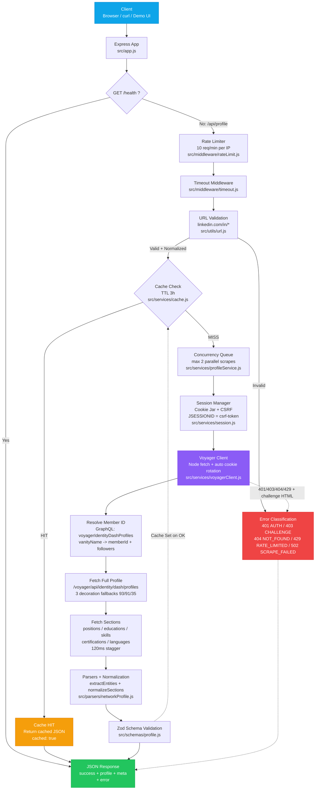

# LinkedIn Profile API

## Live Demo

- **Demo UI:** `https://linkedin-profile-scraper-api-gg5p.onrender.com` — paste any LinkedIn profile URL (or click a sample) to see a summary card + raw JSON
- **Direct API:** `https://linkedin-profile-scraper-api-gg5p.onrender.com/api/profile?url=https://www.linkedin.com/in/padamkataria/`
- **Health:** `https://linkedin-profile-scraper-api-gg5p.onrender.com/health`

## Overview

A publicly hosted HTTPS API that accepts a LinkedIn profile URL and returns structured profile data as JSON. It is a **purely reverse-engineered, browserless** solution: requests go directly to LinkedIn's internal **Voyager API** over plain HTTPS with an authenticated session (cookies + CSRF token) — no browser is launched when extracting a profile.

## Features

- Accepts LinkedIn profile URLs and returns structured JSON
- Extracts: name, headline, location, about, experience, education, skills, certifications, languages, profile images, company, followers
- **Browserless Voyager API extraction** (reverse-engineered GraphQL/RESTLI endpoints)
- Plain Node HTTP client (no Playwright, no headless browser at runtime)
- Robust session handling: cookie jar that applies LinkedIn's cookie rotations automatically
- Authentication-aware with session state management
- In-memory TTL caching (3-hour default)
- Rate limiting (10 req/min/IP) and scrape concurrency controls
- Structured error classification (session expired, challenge, profile not found, rate limited)

## Architecture

### High-Level Flow



### Component Map

| Layer | File | Responsibility |
|-------|------|---------------|
| **HTTP** | `src/app.js`, `src/routes/profile.js`, `src/routes/health.js` | Express wiring, `trust proxy`, static Demo UI, routing |
| **Middleware** | `src/middleware/rateLimit.js`, `timeout.js`, `errorHandler.js` | IP rate limit (10/min), request timeout, global errors |
| **Validation** | `src/utils/url.js` | Strict `linkedin.com/in/` parsing, hostname spoof guard, URL normalization (cache key) |
| **Cache** | `src/services/cache.js` | In-memory TTL (default 10800s / 3h), hit returns `cached:true` |
| **Orchestrator** | `src/services/profileService.js`, `src/services/linkedin.js` | Concurrency queue (max 2), error → HTTP mapping, Voyager orchestration |
| **Session** | `src/services/session.js` | `Cookie` header ↔ `storageState.json`, JSESSIONID↔CSRF, `createCookieJar` with `applySetCookieHeaders` live rotation |
| **Voyager** | `src/services/voyagerClient.js` | `apiFetch` (fetch + 6 redirects + abort), `resolveMemberId` (GraphQL), `fetchFullProfile` (3 decorations), `fetchAllSections` (5 sections) |
| **Parsers** | `src/parsers/networkProfile.js` | `extractEntities` + `parseProfile` + `normalizeSections` → unified schema |
| **Schema** | `src/schemas/profile.js` | Zod runtime validation of public contract |


## Reverse Engineering Findings

LinkedIn's 2026 profile page has been completely restructured:

- **No H1 tags** — profile name uses H2
- **No section IDs** — `#experience`, `#education` etc. don't exist
- **Profile card contains** company, education, location, followers
- **Separate Experience/Education/Skills sections** are no longer rendered in the 2026 UI
- **Voyager API** (`/voyager/api/...` endpoints) still exposes the full profile for authenticated sessions — this is how experience/education/skills/etc. are extracted, via direct HTTPS calls
- **Auth cookie = CSRF token**: the `csrf-token: ajax:...` header value equals the `JSESSIONID` cookie, so no browser is needed to obtain it

See `docs/reverse-engineering.md` for full details.

## Project Structure

```
linkedin-profile-api/
├── src/
│   ├── app.js                    # Express app setup
│   ├── server.js                 # Server entry point
│   ├── config.js                 # Environment configuration
│   ├── routes/
│   │   ├── profile.js            # GET /api/profile
│   │   └── health.js             # GET /health
│   ├── services/
│   │   ├── session.js            # Cookie jar + CSRF/identity extraction from saved session
│   │   ├── voyagerClient.js      # Browserless Voyager API HTTP client
│   │   ├── linkedin.js           # Profile extraction orchestrator (browserless)
│   │   ├── profileService.js     # Cache, concurrency, error handling
│   │   └── cache.js              # In-memory TTL cache
│   ├── parsers/
│   │   └── networkProfile.js     # Voyager JSON → unified profile schema
│   ├── middleware/
│   │   ├── rateLimit.js          # IP-based rate limiting
│   │   ├── timeout.js            # Request timeout
│   │   └── errorHandler.js       # Global error handler
│   ├── schemas/
│   │   └── profile.js            # Zod response validation
│   └── utils/
│       ├── url.js                # LinkedIn URL validation
│       └── logging.js            # Structured JSON logging
├── scripts/
│   ├── apply-cookies.js        # Paste Cookie header -> storageState.json (no browser)
│   ├── test-direct.js          # Browserless direct-endpoint CLI test
│   └── test-api.js             # API integration tests
├── tests/                        # 50 passing tests
├── docs/
│   └── reverse-engineering.md    # Reverse engineering findings + Voyager endpoints
├── Dockerfile                    # Production deployment (no browser)
├── .env.example
├── .gitignore
└── README.md
```

## API Documentation

### GET /api/profile

Returns structured LinkedIn profile data.

**Query Parameters:**

| Parameter | Type | Required | Description |
|-----------|------|----------|-------------|
| `url` | string | Yes | LinkedIn profile URL |

**Example Request:**

```
GET /api/profile?url=https://www.linkedin.com/in/satyanadella/
```

**Success Response (200):**

```json
{
  "success": true,
  "profile": {
    "name": "Satya Nadella",
    "headline": "Chairman and CEO at Microsoft",
    "location": "Redmond, Washington, United States",
    "about": "As chairman and CEO of Microsoft...",
    "profileImageUrl": "https://media.licdn.com/...",
    "bannerImageUrl": "https://media.licdn.com/...",
    "currentCompany": "Microsoft",
    "followers": "12,134,846",
    "experience": [
      {
        "title": "Chairman and CEO",
        "company": "Microsoft",
        "location": "Greater Seattle Area",
        "startDate": "02/2014",
        "endDate": null,
        "duration": "2014-Present",
        "companyUrl": "https://www.linkedin.com/company/microsoft/"
      },
      {
        "title": "Chairman",
        "company": "The Business Council U.S.",
        "location": null,
        "startDate": "2021",
        "endDate": "2023",
        "duration": "2021-2023",
        "companyUrl": "https://www.linkedin.com/company/5301945/"
      }
    ],
    "education": [
      {
        "school": "Manipal Institute of Technology, Manipal",
        "degree": "Bachelor's Degree",
        "field": "Electrical Engineering",
        "startDate": null,
        "endDate": null,
        "grade": null,
        "activities": null
      },
      {
        "school": "University of Wisconsin-Milwaukee",
        "degree": "Master's Degree",
        "field": "Computer Science",
        "startDate": null,
        "endDate": null,
        "grade": null,
        "activities": null
      }
    ],
    "skills": [],
    "certifications": [],
    "languages": []
  },
  "meta": {
    "sourceUrl": "https://www.linkedin.com/in/satyanadella/",
    "cached": false,
    "scrapedAt": "2026-08-27T07:44:18.352Z"
  },
  "error": null
}
```

**Error Response:**

```json
{
  "success": false,
  "profile": null,
  "meta": {
    "sourceUrl": "https://www.linkedin.com/in/test/",
    "cached": false,
    "scrapedAt": null
  },
  "error": {
    "code": "AUTHENTICATION_REQUIRED",
    "message": "Profile extraction failed: LOGIN_WALL"
  }
}
```

### GET /health

```json
{
  "status": "ok",
  "timestamp": "2026-08-27T10:00:00.000Z",
  "uptime": 3600.5
}
```

## Error Codes

| Code | HTTP | Description |
|------|------|-------------|
| `INVALID_URL` | 400 | Missing, malformed, or non-LinkedIn URL |
| `AUTHENTICATION_REQUIRED` | 401 | Session expired or not configured |
| `CHALLENGE_DETECTED` | 403 | LinkedIn challenge/CAPTCHA detected |
| `PROFILE_NOT_FOUND` | 404 | Profile does not exist or is unavailable |
| `RATE_LIMITED` | 429 | Too many requests |
| `SCRAPE_FAILED` | 502 | Scraping failed due to upstream error |

## Local Setup

### Prerequisites

- Node.js >= 18.0.0
- npm
- A throwaway LinkedIn account

### Installation

```bash
git clone https://github.com/yourusername/linkedin-profile-api.git
cd linkedin-profile-api
npm install
```

### Authentication Setup

**Important:** Use a throwaway LinkedIn account, not your personal one.

The extraction is fully browserless — this project contains **no browser automation
code and no browser dependency**. You provide a session by pasting a LinkedIn
`Cookie` header captured manually from any browser:

1. Log in to `linkedin.com` with your throwaway account in your own browser
2. Open DevTools → **Network** tab, click any request to `www.linkedin.com`
3. Copy the full **`cookie:`** request header value
4. Save it, then either:

```bash
# Option A - write it to storageState.json (persisted, auto-loaded)
$env:LINKEDIN_COOKIE_HEADER = "JSESSIONID=ajax:...; li_at=AQED...; bcookie=..."
npm run cookies

# Option B - feed it directly to a server instance
$env:LINKEDIN_COOKIE_HEADER = "JSESSIONID=ajax:...; li_at=AQED...; bcookie=..."
npm start
```

The server reads `LINKEDIN_COOKIE_HEADER` first, then falls back to `storageState.json`.
Refresh the session the same way whenever it expires (the API reports
`AUTHENTICATION_REQUIRED`/401 while stale).

### Running Locally

```bash
npm start
```

### Testing

```bash
# Unit tests (50 tests)
npm test

# Browserless direct-endpoint CLI test (no server needed)
npm run test:direct -- satyanadella

# API integration tests (requires running server)
npm run test:api
```

## Deployment

### Docker

```bash
docker build -t linkedin-profile-api .
docker run -p 3000:3000 -e LINKEDIN_COOKIE_HEADER="JSESSIONID=ajax:...; li_at=AQED..." linkedin-profile-api
```

### Render / Railway

1. Push to GitHub
2. Create a new Web Service
3. Build: `npm install`
4. Start: `npm start`
5. Set env: `LINKEDIN_COOKIE_HEADER` with your pasted `Cookie:` header (or `LINKEDIN_STORAGE_STATE` with `storageState.json` contents)

### Keeping a free instance awake (keepalive)

Free tiers (Render/Railway) spin down after ~15 min of inactivity, so the next request pays a cold-start delay. **The most reliable fix is an external uptime monitor** that pings `/health` every 5–10 minutes. Point it at:

```
https://linkedin-profile-scraper-api-gg5p.onrender.com/health
```

Use `/health` (not `/api/profile`) — it never touches LinkedIn, so pings won't burn session credits or trigger LinkedIn rate limiting.

**Why not rely on GitHub Actions?** The repo's `.github/workflows/keepalive.yml` uses `cron: "*/10 * * * *"`, but GitHub's scheduler is best-effort and frequently delays/skips scheduled runs (observed firing only every 2–3 hours in practice). That is too slow to keep a free Render instance awake, which sleeps after ~15 min. Keep the workflow as a free backup, but do **not** depend on it.

**Recommended services (pick one):**

- **cron-job.org** (free) — create a job → HTTP(S) request to `/health` → set *minutes* to every 10 minutes. Reliable, free, no card.
- **UptimeRobot** (free) — HTTP(S) monitor on `/health` with **5-minute** check interval (safer margin under the 15-min spin-down).
- **Better Stack / Uptime Kuma** — same idea, whichever you already use.

Avoid **Kaffeine**: it pings every ~25 min, which is longer than Render's ~15-min idle timeout, so it will not keep the instance awake.

**Alternatively — self-ping inside the app:** deploy on a paid Render tier (never sleeps), or run `scripts/keepalive.js` from any machine that is on 24/7:

```bash
npm run keepalive -- --url https://linkedin-profile-scraper-api-gg5p.onrender.com/health --interval 600
```

## Known Limitations

- **Hidden profile data:** Some profiles (celebrity accounts) hide skills/certifications/languages even from the API — those fields return empty arrays (correct LinkedIn behavior)
- **Session expiration:** Authenticated sessions expire periodically (LinkedIn force-logs-out); re-capture the cookie header (see Authentication Setup) to refresh. The API reports `AUTHENTICATION_REQUIRED` (401) while the session is stale
- **Rate limiting:** LinkedIn blocks repeated automated access quickly
- **Security challenges:** CAPTCHA cannot be bypassed; detected and reported
- **Single instance:** In-memory cache not shared across instances

## Technical Tradeoffs

| Decision | Choice | Why |
|----------|--------|-----|
| Extraction | Voyager API over direct HTTPS | Only source of full experience/education/skills; no browser required |
| HTTP client | Node native `fetch` | Browserless, zero extra dependency |
| Auth | Session cookies + CSRF (`JSESSIONID`) | Cookie jar handles LinkedIn's per-response cookie rotation |
| Session provisioning | Pasted `Cookie:` header (env var or `storageState.json`) | No browser code in the repo; session captured manually, extracted browserless |
| Cache | In-memory | Simple, sufficient for single-instance |
| Schema | Zod | Runtime validation |

## License

ISC
